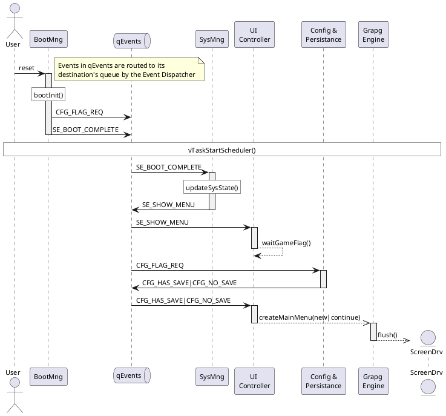
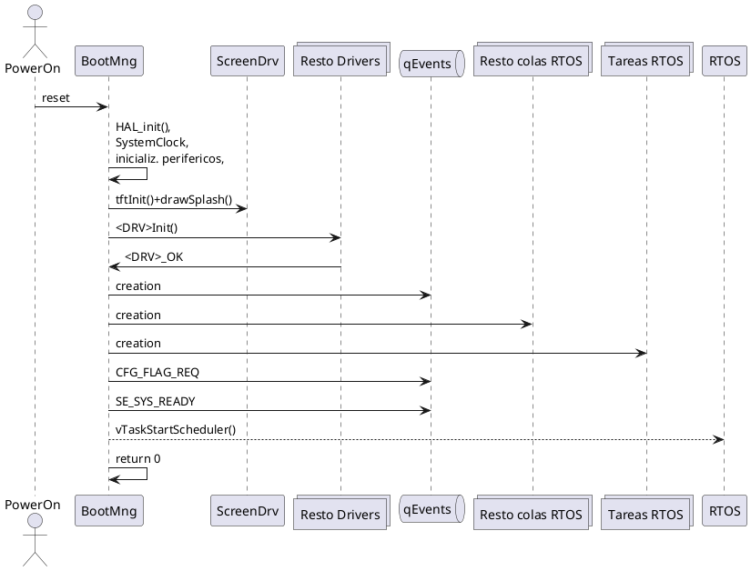
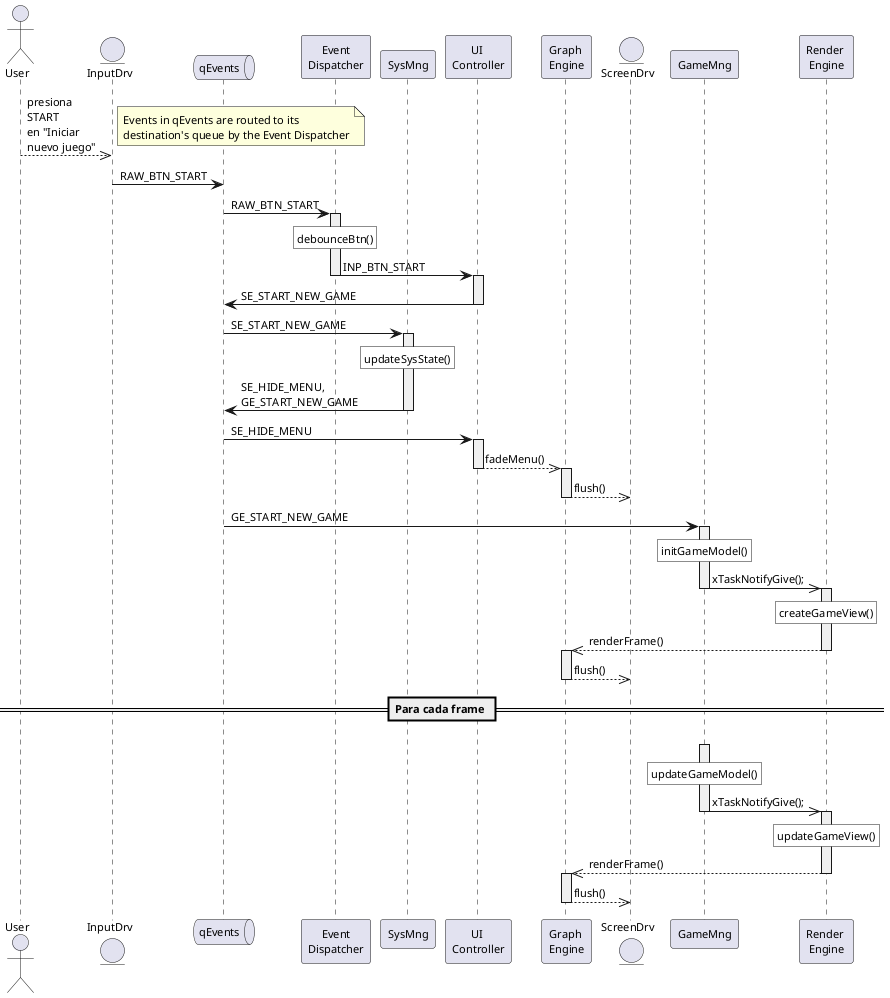

# proyecto RETRO_GAME

## Componentes
|Capa	|Servicio 	|Nombre	|Responsabilidad principal	|Tipo componente	|Notas	|Public Interface	|Sub-componentes / tasks|
|----	|-------- 	|------	|------------------------	|----------------	|-----	|---------------	|-----------------------|
|Drivers	|Driver de acelerómetro	|AccelDrv	|Lectura de acelerómetro (I²C) vía DMA; genera evento DE_ACCEL_DATA_RDY	|Librería	|Publica evento en qEvents; sin lectura directa	|accelInit()	|
|Drivers	|Driver de almacenamiento	|EEPROMDrv	|Lectura/escritura por página vía SPI (25LC256)	|Librería	|CRC opcional	|eepromInit(), eepromRead(uint32_t addr, uint8_t* buf, size_t len), eepromWrite(uint32_t addr, const uint8_t* buf, size_t len)	|
|Drivers	|Driver de pantalla	|ScreenDrv	|Inicialización ST7735; ventana y DMA‑SPI de píxeles	|Librería	|En TFT_ST7735.c	|tftInit(...), tftSetAddressWindow(...), tftDrawImageDMA(...)	|ISR|
|Drivers	|Driver de audio	|AudioDrv	|Reproducción de FX cortos por PWM/DAC usando DMA “one‑shot”	|Librería	|"emite AUD_PLAY_DONE a qEvents al terminar |
|audioPcmCue_t {const int16_t *pcm; uint32_t durationMs}"	|audioInit(), audioPlayFx(const audioPcmCue_t *cue)	|ISR|
|Drivers	|Driver de vibracion	|HapticDrv	|Control del DRV2605L por I2C para vibración	|Librería	|—	|haptic_init(), haptic_play(uint8_t effect_id)	|
|Drivers	|Driver de UART	|UARTDrv	|USART2 TX/RX + DMA	|Librería	|—	|uart_init(), uart_write(const uint8_t* buf, size_t len), uart_read(uint8_t* buf, size_t len)	|
|Drivers	|Driver de entradas	|InputDrv	|Botones por EXTI y joystick por ADC+DMA; ISR/DMA generan eventos crudos en qInputRaw	|Librería	|Sin debounce; configuración por input_hw_cfg_t	|input_init(const input_hw_cfg_t *cfg)	|
|Drivers	|Driver de timers	|TimerDrv	|Wrapper sobre timers de LVGL + timers auxiliares	|Librería	|Permite registro de callbacks	|timer_init_lvgl(), timer_register(timer_cb_t cb, uint32_t period_ms)	|
|Lógica del sistema	|Boot Manager	|BootMng	|Verifica drivers, inicializa RTOS y publica señal SYS_READY	|Librería	|Corre pre‑RTOS	|boot_init()	|
|Lógica del sistema	|Resource Loader	|ResLoader	|Carga de assets en RAM a partir de asset_id; mapea dirección física	|Librería	|"Devuelve puntero + tamaño
Tabla de mapeo interna"	|res_load(asset_id, const void **ptr, size_t *len)	|
|Lógica del sistema	|"Config & Persistence|
|• Save Manager (Game Loader)|
|• Profile Manager"	|ConfigPersist	|Gestiona snapshot y flag en EEPROM; publica CFG_HAS_SAVE / CFG_NOT_SAVE	|Proceso (task)	|Zonas fijas SNAP_ADDR y FLAG_ADDR; cola SAVE_Q	|cp_has_saved_game(), cp_save(const snapshot_t *snap), cp_load(snapshot_t *snap)	|Task + libs|
|Lógica del sistema	|Event Dispatcher / (Input Processor)	|EventDispatcher	|Recibe eventos, aplica InputProcessor (debounce, dead‑zone) y los rutea a colas de destino (EVT_UI_Q, EVT_GAME_Q, …)	|Proceso (task)	|Tabla mapeo de eventos fija: origen → destino	|event_post(const evt_t* e)	|Task + libs InputProcessor: debounceBtn()|
|Lógica del sistema	|UI Controller	|UIController	|Maneja pantallas LVGL: dibuja Splash, Main Menu, Pausa. Gestión de la UI en estados no interactivos del juego	|Proceso (task)	|Usa GraphEngine	|Entradas: UI_CMD_Q. Salidas: UI_EVT_Q (EventDispatcher), DL_UI_Q (drawList_t), AUDIO_UI_Q (audioCue), HAPTIC_UI_Q (hapticCue)	|
|Lógica del sistema	|Graphics Engine	|GraphEngine	|Wrapper LVGL (lv_port_disp, lv_port_indev); convierte drawList_t a llamadas LVGL y delega flush a ScreenDrv	|Proceso (task)	|PrepareTask (LVGL handler) + BlitTask (flush/DMA)	|gfx_submit(const drawList_t *dl)	|Task recurrente + libs (lvgl, lv_port, etc...)|
|Lógica del sistema	|Audio Player	|AudioPlayer	|Reproduce efectos de sonido (FX) cortos	|Librería	|Sin música; consume audioCue{id,durationMs} y llama AudioDrv	|audio_cmd(const audioCue_t *cue)	|
|Lógica del sistema	|Haptic Engine	|HapticEngine	|Gestión de la activación de patrones de vibración	|Librería	|	|haptic_cmd(uint8_t hapticCue)	|
|Lógica del sistema	|"Debug & Logs • Log Sink • Cmd Parser"	|LogSink	|Log_Put() → buffer RAM → UART; comandos logon / logoff cambian flag.	|Proceso (task)	|Usa LOG_Q, CMD_RX_Q; duplica si traceEnabled	|log_put(const char* str), cmd_parser_handle(const char* line)	|Task + libs|
|Lógica del sistema	|System State Mng (FSM-Sistema)	|SysMng	|Implementación de máquina de estados principal del sistema, invoca UpdateEngine (SYS_SPLASH, SYS_MAIN_MENU, SYS_IN_GAME, SYS_PAUSED)	|Proceso (task)	|	|sys_set_state(sys_state_t s), sys_get_state()	|
|Lógica del juego	|Game State Mng (FSM-Gameplay)	|GameMng	|"FSM de juego; invoca UpdateEngine, envía a RenderEngine, genera gameModel y gameSignal[], emite SE_PAUSE_REQ (GME_RUNNING, GME_FROZEN, GME_STOPPED) Update Engine: función Game_Update() llamada una vez por cuadro; calcula posiciones, colisiones simplificadas, puntaje, temporizadores, genera eventos PLAY_SFX y VIBRATE_HIT para gameSignal[]."	|Proceso (task)	|60 Hz	|game_set_state(game_state_t s), game_get_model(gameModel_t *m)	|
|Lógica del juego	|Render Engine	|RenderEngine	|Construye drawList_t, audioCue, hapticCue por cuadro; envía a GraphEngine, AudioPlayer, HapticEngine	|Proceso (task)	|60 Hz	|render_tick()	|
|Lógica del juego	|Input Handler	|InputHandler	|Convierte eventos normalizados en acciones de gameplay (mover nave, disparar). Genera GE_PAUSED cuando detecta pausa.	|Proceso (task)	|Envía GE_PAUSED a GameMng	|input_handle_evt(const evt_t *e)	|

## Nombres de objetos
|Tarea	|Prioridad en FreeRTOS|
|------ |--- |
|tskEvntDisp	|5|
|tskGraph	|4|
|tskGameMng	|3|
|tskRender	|3|
|tskInpHnd	|3|
|tskUiCtrl	|2|
|tskSysMng	|2|
|tskPersist	|1|

|Componente	|Colas de recepcion de mensajes	|Cola de envío de mensajes|
|---- 			|---- 		| ----- |
|BootMng		|-			|qEvents|
|ResLoader		|qResLoad	|qEvents|
|ConfigPersist	|qPersist	|qEvents|
|EventDispatcher|qEvents	|todas|
|UIController	|qUiCtrl	|qEvents|
|GraphEngine	|qGraph		|qEvents|
|AudioPlayer	|qAudio		|qEvents|
|HapticEngine	|qHaptic	|qEvents|
|LogSink		|qLog		|qEvents|
|SysMng			|qSystem	|qEvents|
|GameMng		|qGame		|qEvents|
|RenderEngine	|qRender	|qEvents|
|InputHandler	|qInHand	|qEvents|

## Flujos

Zoom en bootInit():

Seq	Actor	Acción / evento
Boot	MCU reset → main()	
0	BootMng	HAL_Init(), relojes, SysTick
1	BootMng	ScreenDrv.tftInit() → tftDrawImage() (splash sin LVGL)
2	BootMng	Inicializa drivers restantes; espera drvOk de todos los drivers
3	BootMng	Crea colas 
4	BootMng	Crea tareas permanentes
5	BootMng	Encola CFG_REQ_FLAG → qEvents
6	BootMng	(si todo OK) Encola SE_BOOT_COMPLETE → qEvents
7	BootMng	Devuelve; arranca vTaskStartScheduler()
8	tskEvntDisp	Recibe SE_BOOT_COMPLETE, lo reenvia → qSystem
9	tskSysMng	Estado SYS_SPLASH→SYS_MAIN_MENU; encola SE_SHOW_MENU → qEvents
10	tskEventDispatcher	Ruta SE_SHOW_MENU → qUiCtrl
11	tskUiCtrl	Se bloquea en espera del flag de existencia de juego guardado
12	tskPersist	Lee flag EEPROM → envía CFG_NO_SAVE → qEvents
13	tskEventDispatcher	Ruta CFG_NO_SAVE → qEvtUi
14	tskUiCtrl	Construye menú con LVGL (llamadas directas), Deshabilita opción «Continuar»
15	tskGraph	Cada 16 ms: lv_timer_handler() 
15	SreenDrv	Lamada directa desde tskGraph → flush DMA
16	IRS DMA Screen	lv_disp_flush_ready()  avisa a LVGL de la liberacion del display
17	Jugador	Pulsa botón START
18	ISR EXTI	InputDrv_isr() lee GPIO y coloca RAW_BTN_START → qEvents
19	tskEvntDisp	Despierta y pasa el mensaje al InputProcessor interno.
20	InputProcessor (SW)	Debounce + espera 20 ms → confirma flanco
21	tskEvntDisp	Encola INP_BTN_START → qUiCtrl
22	tskUiCtrl	Despierta, recibe INP_BTN_START
23	tskUiCtrl	Encola SE_START_NEW_GAME → qEvents
24	tskEvntDisp	Ruta SE_START_NEW_GAME → qSystem
25	tskSysMng	Transiciona SYS_MAIN_MENU → SYS_IN_GAME
26	tskSysMng	Encola SE_HIDE_MENU, GE_START_NEW_GAME → qEvents
27	tskEvntDisp	"Rutea:
 • SE_HIDE_MENU → qUiCtrl
 • GE_START_NEW_GAME → qGameMng"
28	tskUiCtrl 	"Recibe SE_HIDE_MENU → ejecuta fade-out (anim de SquareLine/LVGL).
 Al terminar: vTaskSuspend(NULL) (queda dormida hasta pausa).
 (Opcional: antes de suspender, encolar SE_UI_HIDDEN)"
29	tskGameMng	"Recibe GE_START_NEW_GAME → inicializa: limpia gameModel, gameSignal[], resetea timers/cooldowns, setea buffers modelBuf[2] y readyIdx=0.
 Hace el primer update (frame 0), publica el índice listo y notifica a Render:
 xTaskNotifyGive(tskRenderHandle);"
30	tskRender	"Está bloqueada en ulTaskNotifyTake(pdTRUE, portMAX_DELAY).
 Al recibir la primera notificación:
  • Si no existe, crea la vista de juego (objetos LVGL):
   – contenedor fondo (cielo)
   – gameView (canvas u objetos lv_img que moverás)
   – overlay cockpit (imagen con alpha)
  • Dibuja el frame 0 leyendo modelBuf[readyIdx]."
31	tskGraph	Sigue con lv_task_handler() cada ~16 ms;
32	tskGameMng	Empieza gameplay → genera GME_START_OK