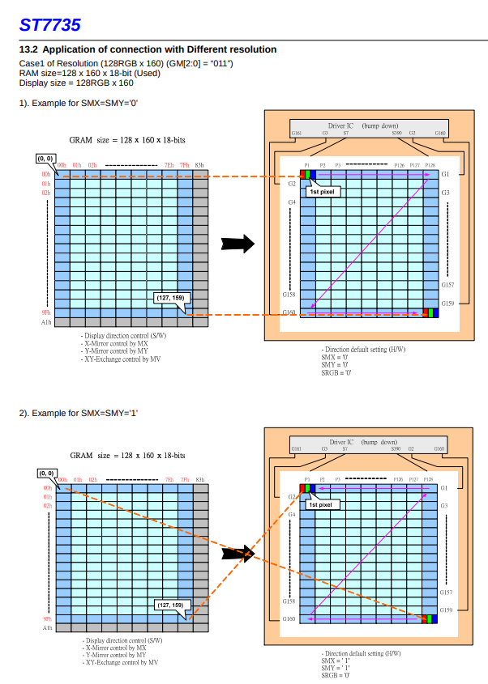

# ST7735

Display data can be stored in the on-chip display data RAM of 132 x 162 x 18 bits (**buffer de pantalla**)

Idle mode: 
- OFF: 262K colores RGB 6-6-6
- ON: solo 8 colores RGB 1-1-1 

Color depth:
- 12 bits: RGB 4-4-4 (4K colores)
- 16 bits: RGB 5-6-5 (65K colores) - equilibrio entre velocidad de comunicacion y calidad de colores
- 18 bits: full mode 6;6;6 262K colores

NOTA: Siempre, internamente, el chip guarda 18 bits de color para cada píxel.

## SPI:
The selection of this interface is done by IM2. See the Table 9.3.1.
| IM2 | SPI4W | Interface Read back selection |
| --- | ----- | ----------------------------- |
| 0   | 0     | 3-line serial interface Via the read instruction (8-bit, 24-bit and 32-bit read parameter) |
| 0   | 1     | 4-line serial interface Via the read instruction (8-bit, 24-bit and 32-bit read parameter) |

| Modo | Líneas usadas | Bits por transmisión | ¿Cómo funciona? |
| ---- | ------------- | -------------------- | ---------------- |
| 3-line SPI | CSX, SCL, SDA (compartido) | 9 bits | El primer bit indica si es comando (0) o datos (1), y los 8 bits siguientes son el comando o el dato. |
| **4-line SPI** | CSX, D/CX*, SCL, SDA | 8 bits | D/CX decide si lo que mandás es comando (D/CX=0) o datos (D/CX=1). Luego los 8 bits de info. |

*El pin D/CX es el A0 del módulo. Además requiere pin de RESET (active LOW).

El modo de 3 lineas complica las cosas, porque la mayoría de los controladores SPI de microcontroladores no manejan 9 bits de SPI nativamente.

Config SPI:
- CS es active LOW. En high se inicializa la interfaz SPI.
- Falling edge del CS
- Sampling en el rising edge del reloj (CPOL/CPHA `00` o `11` )
- MSB first


Command Write Mode: 
- If D/CX is “high”, the transmission byte is stored in the display data RAM (memory write command), or command register as parameter. 
- Any instruction can be sent in any order to the driver. 

Read Functions:sudo apt install sigrok sigrok-cli pulseview sigrok-firmware-fx2lafw
- The read mode of the interface means that the micro controller reads register value from the driver. 
- To achieve read function, the micro controller first has to send a command (read ID or register command) and then the following byte is transmitted in the opposite direction.
- The driver samples the SDA (input data) at rising edge of SCL, but shifts SDA (output data) at the falling edge of SCL. Thus the micro controller is supported to read at the rising edge of SCL
- After the read status command has been sent, the SDA line must be set to tri-state no later than at the falling edge of SCL
of the last bit.  --> **configurar pin SDA como entrada**

| Caso | Comando | Bytes que responde el display | ¿Qué significa? |
| ---- | ------- | ----------------------------- | --------------- | 
| 8-bit read | RDID1/RDID2/RDID3/0Ah-0Fh | 1 byte | Leer un dato simple (ID parcial, info básica) |
| 24-bit read | RDDID | 3 bytes | Leer identificación completa de pantalla |
| 32-bit read | RDDST | 4 bytes | Leer estado interno de la pantalla |

## Data Transfer Modes 
Data can be downloaded to the frame memory by 2 methods.
- Método 1: Transferencia continua
    - Empieza con un comando `Memory Write`.
    - Manda info de pixel, pixel, pixel... uno tras otro sin parar.
    - Cuando termina de llenar toda la pantalla, el puntero de la RAM se resetea solo al principio (0,0).
    - Si se sigue mandando datos, se sobreescribe desde el inicio de la memoria.
- Método 2: Transferencia controlada
    - Empieza con un comando `Memory Write`.
    - Mandás los datos de tu imagen.
    - Antes de terminar, manda un comando `Memory Write End` (comando especial).
    - Después, para la próxima imagen, inicia de nuevo con `Memory Write`.

El método 2 es un flujo más controlado, ideal para hacer refreshs parciales o manejar varias ventanas de dibujo.


NOTA: para 12 o 16 bits, simplemente se mandan los 12/16 bits de un pixel seguidos de los 12/16 bits del siguiente, pero para 18 bits se envian 6 bits de RED seguidos de dos bits IGNORADOS, luego los 6 bits de GREEN seguido de 2 bits IGNORADOS y luego los 6 bits de BLUE seguidos de 2 bits IGNORADOS, por lo que *se termina enviando una comunicacion de 3 bytes completos por pixel*.

## Memory to Display Address Mapping 

When using 128RGB x 160 resolution (GM[2:0] = "011", SMX=SMY=SRGB= "0") 


El área visible de la `frame memory` es de columnas 0x00 a 0x7F (0 a 127 en decimal) y páginas 0x00 a 0x9F (0 a 159 en decimal).
Para dibujar un pixel en la esquina superior izquierda de la pantalla, hay que escribir en la posición de memoria (columna 0, fila 0).

## Partial Display On
Este es un modo especial donde solo una parte de la pantalla se actualiza o se muestra activamente:

Se define una "ventana activa" mediante dos registros:
- PSL (Partial Start Line) → línea de inicio.
- PEL (Partial End Line) → línea de fin.
- Flags MX=MY=ML=SMX=SMY=0:
    - MX (Mirror X): 0 → no inviertes izquierda-derecha.
    - MY (Mirror Y): 0 → no inviertes arriba-abajo.
    - ML (Memory Layout): 0 → organización normal (filas/columnas estándar).
    - SMX/SMY (Scan direction modifiers): 0 → no cambian el orden de escaneo de píxeles.

Ejemplo:
- PSL = 0x04 → la pantalla empieza a mostrar desde la línea 4,
- PEL = 0x9B → hasta la línea 155.

Las zonas que no están dentro del rango PSL–PEL se apagan (pueden mostrar un color fijo, como negro o blanco, dependiendo de configuración). No consumen energía activa para refresco (ideal para ahorrar batería o para interfaces donde solo mostrás información en una franja).

## Address Counter
Es el puntero interno que dice dónde se va a escribir o leer dentro de la RAM de la pantalla. Siempre definís una ventana antes de escribir.

Se definen ventanas de memoria usando:
- XS, YS (start column, start row).
- XE, YE (end column, end row).
Después de completar el dato de un píxel (según el modo 18, 16 o 12 bits), se escribe en la RAM en la posición indicada.
Para escribir toda la pantalla (en modo 128x160): XS = 0, YS = 0, XE = 127, YE = 159.

Cómo avanza el puntero de dirección:

- Modo horizontal (MV=0):
    - X (columna) incrementa después de cada píxel.
    - Cuando X pasa XE, X vuelve a XS y Y incrementa.
- Modo vertical (MV=1):
    - Y (fila) incrementa después de cada píxel.
    - Cuando Y pasa YE, Y vuelve a YS y X incrementa.
Cuando se llega al final del área de ventana (XE, YE) se resetea el puntero automáticamente a (XS, YS).

## Niveles de alimentación

| Nivel | Estado | Descripción | Consumo |
| ----- | ------ | ----------- | ------- |
| 1 | Modo Normal On (pantalla completa), Idle Off, Sleep Out | Pantalla completa activa, mostrando hasta 262.144 colores. | Máximo |
| 2 | Modo Parcial On, Idle Off, Sleep Out | Solo parte de la pantalla activa, con hasta 262.144 colores. | Alto |
| 3 | Modo Normal On (pantalla completa), Idle On, Sleep Out | Pantalla completa activa, pero solo con 8 colores. | Medio |
| 4 | Modo Parcial On, Idle On, Sleep Out | Solo parte de la pantalla activa y con solo 8 colores. | Bajo |
| 5 | Modo Sleep In | El conversor DC-DC, el oscilador interno y el driver de panel están apagados. Solo funciona la interfaz MCU y la memoria con VDDI. El contenido de la memoria se mantiene. | Muy bajo |
| 6 | Modo Power Off | VDD y VDDI apagados. El display está completamente sin alimentación. | Mínimo |

## Comandos
Comandos principales de flujo lógico de la pantalla:

| Instrucción | Hex | Bits D7-D0 | Función | Uso práctico | Cantidad de parámetros | Explicación de parámetros |
|:---|:---|:---|:---|:---|:---|:---|
| RDDID* | 04h | 0000 0100 | Leer identificación del display | Se usa para leer la identificación de fabricante, versión y tipo de módulo. | 0 (en transmisión) / 3 bytes en recepción | 1° byte: dummy, 2° byte: Manufacturer ID (ID17–ID10), 3° byte: Version ID (ID26–ID20), 4° byte: Driver ID (ID37–ID30). |
| SLPIN | 10h | 0001 0000 | Entrar en modo Sleep | Apaga el panel para ahorro de energía, conserva memoria. Esperar 120 ms después. | 0 | - |
| SLPOUT | 11h | 0001 0001 | Salir de modo Sleep | Obligatorio después de SWRESET para que el display responda. Esperar 120 ms después. | 0 | - |
| SWRESET | 01h | 0000 0001 | Reset de software | Se manda apenas se enciende para asegurar estado limpio. Esperar 120 ms después. | 0 | - |
| CASET | 2Ah | 0010 1010 | Definir rango de columnas (X) | Selecciona el área horizontal a escribir. | 4 | XS[15:8], XS[7:0], XE[15:8], XE[7:0]. |
| RASET | 2Bh | 0010 1011 | Definir rango de filas (Y) | Selecciona el área vertical a escribir. | 4 | YS[15:8], YS[7:0], YE[15:8], YE[7:0]. |
| RAMWR | 2Ch | 0010 1100 | Comenzar escritura en RAM | Se usa para enviar datos de píxeles a pantalla. | N (datos) | Se envían los datos de color en formato 16 o 18 bits, según COLMOD. |
| DISPON | 29h | 0010 1001 | Encender la pantalla | Hace visible el contenido de la memoria RAM. | 0 | - |
| MADCTL | 36h | 0011 0110 | Control de acceso de memoria | Define rotaciones o espejado de imagen. | 1 | Bits de control: MY, MX, MV, ML, RGB, MH. |
| IDMOFF | 38h | 0011 1000 | Desactivar Idle Mode | Vuelve a modo de colores completos (262K colores). | 0 | - |
| IDMON | 39h | 0011 1001 | Activar Idle Mode | Pasa a modo de 8 colores para consumo ultra bajo. | 0 | - |
| COLMOD | 3Ah | 0011 1010 | Seleccionar formato de pixel | Permite elegir entre 16 bits (RGB565) o 18 bits (RGB666). | 1 | 0x05 para 16 bits, 0x06 para 18 bits. |

*Se puede separar en 3 comandos:
| Comando | Código Hex | Qué devuelve | Byte recibido |
| ------- | ---------- | ------------ | ------------- |
| RDID1 | 0xDA | Manufacturer ID | 1 byte |
| RDID2 | 0xDB | Version ID | 1 byte |
| RDID3 | 0xDC | Driver ID | 1 byte |

Comandos principales del display físico (al iniciar el display):

| Instrucción | Hex | Bits D7-D0 | Función | Uso práctico | Cantidad de parámetros | Explicación de parámetros |
|:---|:---|:---|:---|:---|:---|:---|
| FRMCTR1 | B1h | 1011 0001 | Configurar tasa de refresco normal | Ajusta timing de actualización para consumo/calidad | 6 | RTNA, FPA, BPA (por timing de líneas y porch) |
| INVCTR | B4h | 1011 0100 | Control de inversión de pantalla | Define el modo de inversión de píxeles para mejor contraste | 1 | Bits NLA, NLB, NLC: tipo de inversión (column, line, etc) |
| DISSET5 | B6h | 1011 0110 | Configurar funciones básicas de display | Ajustes de delay, gate control y normalización | 2 | Bits NO, SDT, EQ, PT: control de señales internas |
| PWCTR1 | C0h | 1100 0000 | Control principal de voltajes | Ajuste de voltaje de alimentación principal (GVDD) | 2 | VRH (nivel de voltaje) e IBSEL (corriente) |
| PWCTR2 | C1h | 1100 0001 | Control secundario de voltajes | Ajusta VGH/VGL (voltajes de líneas de matriz) | 1 | BT (factor de boosting de tensiones internas) |
| VMCTR1 | C5h | 1100 0101 | Control de voltajes VCOM | Ajuste de niveles de voltaje VCOMH y VCOML | 2 | VMH (VCOM High), VML (VCOM Low) |
| GAMCTRP1 | E0h | 1110 0000 | Configurar curva Gamma positiva | Corrige luminosidad y contraste para tonos claros | 15 | 15 parámetros para puntos de gamma positiva |
| GAMCTRN1 | E1h | 1110 0001 | Configurar curva Gamma negativa | Corrige luminosidad y contraste para tonos oscuros | 15 | 15 parámetros para puntos de gamma negativa |




## comunicaciones


## Escribir en la pantalla

1. Selección de la ventana de dibujo (si es todo debe ser 128×160) con CASET y RASET,
```c
// ---------- Seleccionar área completa ----------
HAL_GPIO_WritePin(CS_GPIO_Port, CS_Pin, GPIO_PIN_RESET);

// Enviar comando CASET (columna start/end)
HAL_GPIO_WritePin(DCX_GPIO_Port, DCX_Pin, GPIO_PIN_RESET);
uint8_t cmd = 0x2A; // CASET
HAL_SPI_Transmit(&hspi1, &cmd, 1, HAL_MAX_DELAY);

// Enviar datos: XS=0, XE=127 (128 columnas)
HAL_GPIO_WritePin(DCX_GPIO_Port, DCX_Pin, GPIO_PIN_SET);
uint8_t caset_data[4] = { 0x00, 0x00, 0x00, 0x7F }; // XS, XE
HAL_SPI_Transmit(&hspi1, caset_data, 4, HAL_MAX_DELAY);

// Enviar comando RASET (fila start/end)
HAL_GPIO_WritePin(DCX_GPIO_Port, DCX_Pin, GPIO_PIN_RESET);
cmd = 0x2B; // RASET
HAL_SPI_Transmit(&hspi1, &cmd, 1, HAL_MAX_DELAY);

// Enviar datos: YS=0, YE=159 (160 filas)
HAL_GPIO_WritePin(DCX_GPIO_Port, DCX_Pin, GPIO_PIN_SET);
uint8_t raset_data[4] = { 0x00, 0x00, 0x00, 0x9F }; // YS, YE
HAL_SPI_Transmit(&hspi1, raset_data, 4, HAL_MAX_DELAY);
```
2. Escritura con RAMWR: Enviar una secuencia de píxeles en orden de izquierda a derecha, arriba hacia abajo, cada uno en formato RGB565 (2 bytes).
```c
// ---------- Comenzar escritura de memoria ----------
HAL_GPIO_WritePin(DCX_GPIO_Port, DCX_Pin, GPIO_PIN_RESET);
cmd = 0x2C; // RAMWR
HAL_SPI_Transmit(&hspi1, &cmd, 1, HAL_MAX_DELAY);

// Enviar color (ejemplo: rojo 0xF800)
HAL_GPIO_WritePin(DCX_GPIO_Port, DCX_Pin, GPIO_PIN_SET);
uint16_t color = 0xF800; // Rojo RGB565

// se envia en 2 bytes diferentes (16 bits)
uint8_t pixel_data[2];
pixel_data[0] = color >> 8;     // MSB will be sen first
pixel_data[1] = color & 0xFF;   // LSB

// Repetir para cada píxel
for (int i = 0; i < 128 * 160; i++) {
    HAL_SPI_Transmit(&hspi1, pixel_data, 2, HAL_MAX_DELAY);
}

HAL_GPIO_WritePin(CS_GPIO_Port, CS_Pin, GPIO_PIN_SET);
```